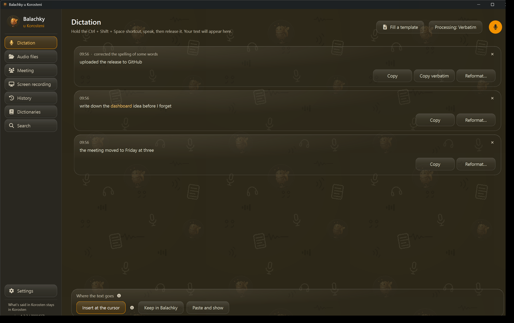
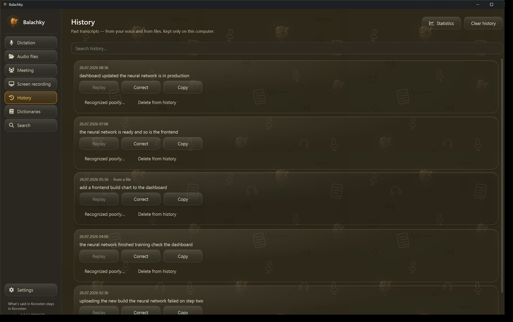
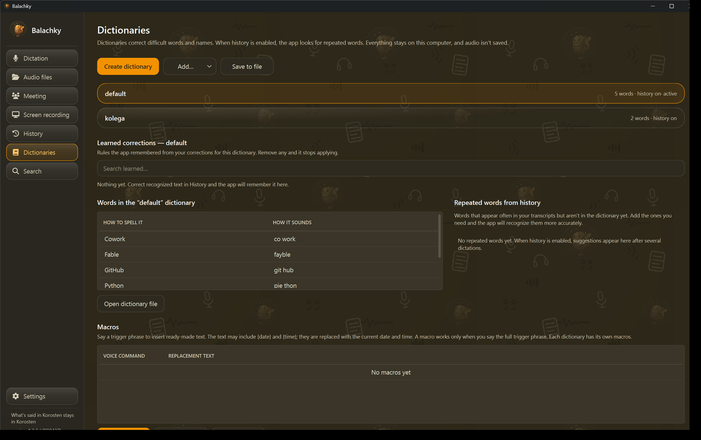
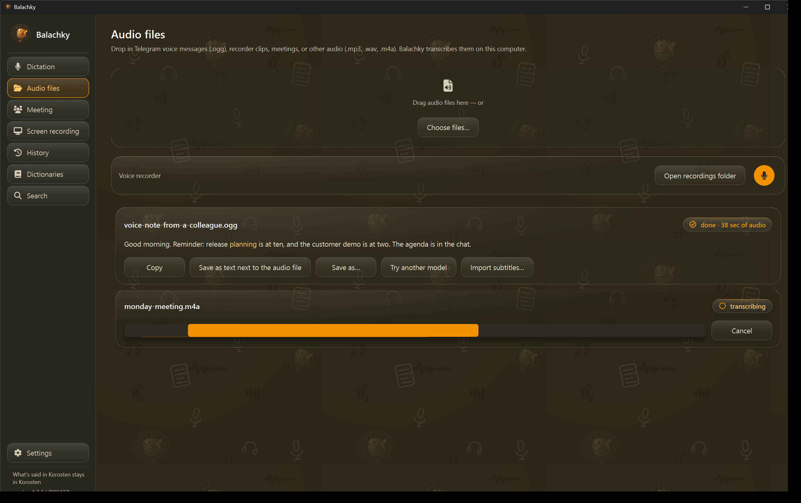
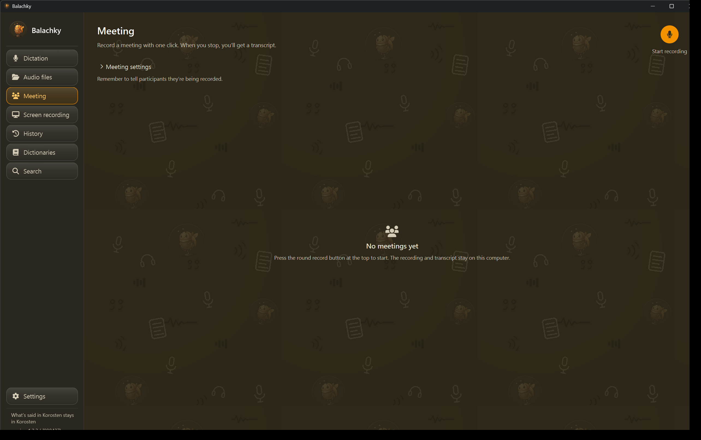
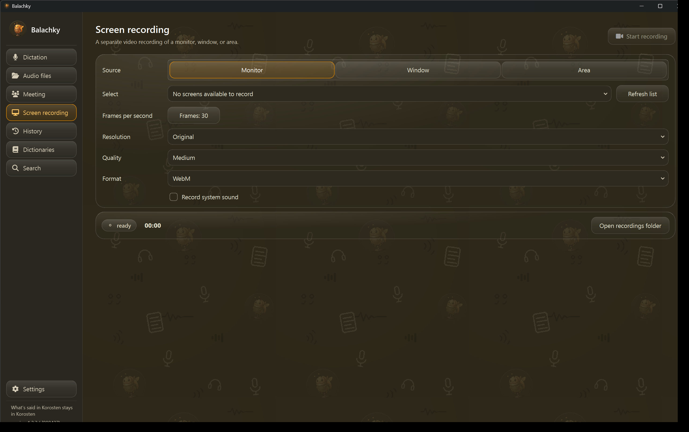
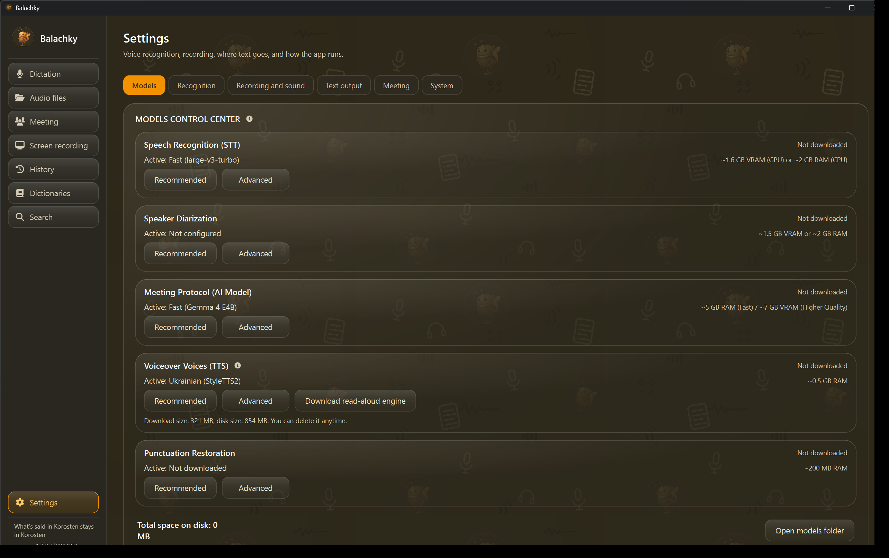

<strong>English</strong> · <a href="README.uk.md">Українська</a>

  

<h1 align="center">Balachky</h1>

Offline dictation and meetings, Ukrainian-first. Fully private. For Windows.

<em>What is said in Korosten stays in Korosten.</em>

  
  
  
  
  

  
   
  Windows 10/11 (x64) · 158.9 MB installer · free, no account

  

---

Balachky is a Windows app that turns your speech into text in any field of any program and turns meeting recordings into ready-to-use minutes. Recognition happens on your computer: voice and transcripts are not uploaded. The app goes online only for user-requested model, optional component, and update downloads, plus update checks if you enable them. Ukrainian is not "one of a hundred languages" in a dropdown here — it is the main one: interface, recognition, dictionaries, and minutes.

> This is a public beta. Features, interface details, and future terms for modules outside basic dictation may change. Basic local dictation remains free.

"Balachky" (Балачки) is Ukrainian for "chit-chat". Korosten is the town in Ukraine where the app is made — hence the motto.

## Why Balachky?

<table>
  <tr>
    <td width="50%" valign="top">
      <h3>Ukrainian-first, not second-class</h3>
      
Interface, recognition, dictionaries, and minutes — all Ukrainian, from the first screen. Not a translation of someone else's app, but a tool built in Ukraine, for Ukrainians.

    </td>
    <td width="50%" valign="top">
      <h3>Privacy is architecture, not a toggle</h3>
      
Recognition, minutes, and storage all run on your computer: zero telemetry, zero accounts. And the network activity journal lets you verify instead of taking our word for it.

    </td>
  </tr>
  <tr>
    <td width="50%" valign="top">
      <h3>Honesty about AI limits</h3>
      
If a component isn't installed, the app says "install the component" instead of showing an empty stub. The "Listen" button clearly states that its engine must be installed first. Beta means beta: everything unfinished is marked as such.

    </td>
    <td width="50%" valign="top">
      <h3>Free dictation; meetings free during beta</h3>
      
Dictation is free forever — even for companies. Meetings are free during the beta. No accounts, no cards, no "trial periods".

    </td>
  </tr>
</table>

## Who it's for

Anyone who dictates a lot or records meetings in Ukrainian. But first of all — those whose conversations cannot go to a cloud:

- **Military.** Duty meetings and reports stay on the device. Screen-capture protection (enabled in Settings) and a panic button help keep sensitive material private.
- **Doctors.** Visit notes and consultations never leave the office.
- **Lawyers.** Confidential conversations can be kept encrypted; if a meeting is left unencrypted, the app honestly shows a banner.
- **Journalists.** Interview recordings never reach someone else's servers — the source is protected technically, not by a promise.
- **People who talk to AI all day.** Most of us speak several times faster than we type. Dictate prompts straight into any chat window — and because Balachky is offline, your drafts don't pass through yet another cloud before they reach the model.

If you simply don't want to hand your voice to a cloud — the app is for you too.

## Features

Everything below works without the internet, once the models you need are downloaded.

### Dictation

- **Text where the cursor is.** Hold the hotkey and speak — text appears in any field: email, messenger, Word, an AI chat. You choose where it goes: "Into the selected app" or "Keep in Balachky".
- **Three cleanup levels, one slider.** "Verbatim", "No filler words", or "With punctuation". The verbatim version is always kept intact in History — you can go back and compare.
- **Re-listen and fix yourself.** Every dictation in History can be replayed in your own voice and corrected. Corrections are stored separately, while the original recording remains unchanged.

  
   
  Replay, correct, copy, or search past transcripts without sending them anywhere.

- **A dictionary that learns once.** Fix a word once — the mistake never repeats. Dictionaries are isolated: work and home don't pollute each other, and any remembered fix can be undone. An error diary shows which corrections repeat most — one click adds them to the dictionary.

  
   
  Keep work and personal vocabulary separate, and inspect every learned correction.

- **Your choice of language.** Ukrainian by default. Pick any of the ~99 languages the model knows, or let the app detect the language itself.
- **Navigate documents by voice.** Edit text and move across Word fields and Excel cells with commands such as "next field" and "next cell".
- **A profile per window.** The app switches dictionary and mode based on the active window. To prevent text from landing in the wrong place, you can pin the insert target.
- **Hotkeys without surprises.** Native key handling, no keyboard hooks. If a combination is taken by the system, the app honestly shows the conflict instead of silently failing.
- **Existing recordings too.** Drop in a voice message, recorder clip, or other audio file. Balachky transcribes it locally and lets you copy or export the result.

  
   
  Transcribe existing recordings and export the result without leaving Balachky.

### Meetings

A "Meeting" is a recording, its transcript, and the minutes in one place.

  
   
  Start a local meeting recording with one button; the recording and transcript stay on this computer.

- **Tracks instead of mush.** Your voice and the other voices are recorded as separate tracks. In the player each track can be muted, turned down, or soloed — all in sync.
- **"Who said what".** Not a word is lost: the app splits the conversation by speaker — "Speaker 1", "Speaker 2" — and you rename them. The speaker count can be set in advance. If the diarization model isn't installed, the meeting works as usual.
- **AI minutes — locally.** Summary, decisions, tasks with timecodes, and sections, generated on your machine (Gemma 4, two sizes to choose from). Export to Word — including the statutory report form.
- **Ask the meeting.** "What did we decide about deadlines?" — the answer comes with clickable timecode quotes: click, and the player jumps there. If the model is missing, the app honestly says "install the component" instead of showing an empty stub.
- **Editing without destruction.** Classified fragments can be muted — only in the chosen track; other voices stay untouched. Redaction leaves the original intact — only the exported version is changed.
- **Bilingual memory.** A meeting can keep context in Ukrainian and English in parallel.
- **Video and screen.** Built-in screen recording, and a built-in video player: seek and 0.5x-2x speed with voice pitch preserved.

  
   
  Record a monitor, a window, or a selected area with the quality and format you choose.

- **Thoughtful details.** With your consent, the meeting name comes from your local calendar; notes export to Obsidian.

### Privacy and provability

- **Meeting encryption: AES-256-GCM.** Encryption is optional and user-controlled. After recording ends, each meeting artifact is encrypted with a separate key. You can protect each meeting with your Windows account, a password, a key file, or both a password and a key file. Working files may temporarily remain unencrypted on disk while a meeting is being recorded, and the app shows the current protection state. A recovery code is issued with password- or key-file-based protection.
  <!-- SCREENSHOT: meeting protection dialog — the four key options -->
- **Evidence package for a commission.** One click builds a package with a standalone verifier (verify.py) that runs on a clean machine, without installing Balachky — all it needs is Python 3 and the cryptography library. It includes confirmation that a second officer viewed the material ("four eyes") and a record of who captured it.
- **Signed integrity journal.** Entries are chained by hashes; the journal is Ed25519-signed. Change a single line — and verification honestly says BROKEN.
- **Provable offline.** A built-in network activity journal shows model, optional component, and update downloads, plus update checks you allow. It comes with a guide on how to verify traffic independently with third-party tools.
- **Field protection.** The app window never lands in screenshots or capture tools if you enable this protection in Settings (off by default) — enforced by the Windows `WDA_EXCLUDEFROMCAPTURE` flag. Always on, no toggle needed: the clipboard is cleaned up, and the app is excluded from Windows error reports. A panic button (you assign the combination yourself in Settings) destroys decrypted meeting copies, resets the vault password cache, clears the clipboard, and minimizes the app window.
- **Voice memory — only with consent.** The app can recognize regular interlocutors, but remembers a voice only after your explicit permission.

### Read-aloud ("Listen")

- The "Listen" button is already in the interface — it will read dictation or meeting text aloud.
- Build 1.2.3 doesn't include the speech engine yet: it needs a separate build and will arrive in a later update — offline like everything else. We'd rather honestly show a button that's "on its way" than pretend it's done.

### For those who automate

- **Command line.** Transcription, dictionary, history, and export via CLI with structured output (--json) — for scripts and your own integrations.
- **MCP server.** Balachky can act as a toolset for AI agents. It provides AI agents with transcription, search, dictionary management, exports, and meeting-minutes tools. The agent is confined to the app's data. This works only if you run the app from source — it is not yet enabled in the packaged installer. Details: [docs/MCP-SERVER.md](docs/MCP-SERVER.md).

### Little things you get used to

- **A model control center** in Settings: every model in one place — speech recognition, speaker voices, AI minutes, punctuation, and the upcoming read-aloud. You see each model's size, whether it is already downloaded, which one is active, and how much disk space they take together.

  
   
  See which components are active, what they need, and how much disk space they use.

- **Workspace background — your choice:** the beetle mascot, a solid color, or your own image (PNG, JPG, or WEBP up to 20 MB).
- **The model frees memory by itself.** If you don't dictate for a while (10 minutes, say), the app unloads the model from video memory — the graphics card is free for other work. Your next recording loads it back, with nothing to press.
- Glass panels, a beetle-and-microphones background pattern, an animated beetle on the splash screen.
- Self-update with checksum verification: an "Update now" button and a "What's new" list.
- An "About" hub via the sidebar header: version and build number, help, third-party licenses, problem reporting.
- Move your profile to another machine as a single file.

## Quick start

**System requirements:** Windows 10/11 (x64), 8 GB RAM (16 GB recommended for meetings), and free space for whatever you use: the installer is 158.9 MB, the "Fast" speech model about 1.6 GB, and the Gemma AI-minutes model about 5 GB (needed only for meeting minutes). So dictation alone fits in roughly 2 GB.

1. Download `BalachkySetup-1.2.3-beta-F19111EF.exe` from the [v1.2.3-beta release](https://github.com/mykola-zhukovets/balachky/releases/tag/v1.2.3-beta). The checksum prefix is right in the file name, so the build is easy to recognize.
2. Optionally verify the SHA-256 against the sum published with the release:
   `F19111EFC61FBA327148E1AC29AFB339E838556663FF73300290DCC6B5D7082F`
   (in PowerShell: `Get-FileHash`).
3. Run the installer.
4. The first-run wizard downloads the chosen speech model. **This one-time download is 1.6 GB or more and requires an internet connection.** After that the app works offline. The meeting-minutes model (about 5 GB) is a separate, later download if you want it.
5. Hold **Ctrl + Shift + Space** and speak — text appears where the cursor is. You can change the shortcut in Settings.
6. To record a meeting, open the "Meeting" tab and press "Start recording". Stop it — get the transcript, then build the minutes with one button.

> **If Windows shows "Unknown publisher".** The beta installer is not digitally signed yet — a certificate costs hundreds of dollars a year, and the app is free. For a new app this is normal. Click "More info" → "Run anyway". Step-by-step guide: [docs/INSTALL-SMARTSCREEN.md](docs/INSTALL-SMARTSCREEN.md). Signing will come later.

VirusTotal result for this exact file: [0/65 detections](https://www.virustotal.com/gui/file/f19111efc61fba327148e1ac29afb339e838556663ff73300290dcc6b5d7082f/detection). This scan is an additional signal, not a substitute for verifying the SHA-256.

## FAQ

**Does the app really work offline?**
Yes. Recognition, minutes, dictionaries, and storage work locally. The network is used for models, optional components, and updates you choose to download, plus update checks if you enable them. Settings contain a network activity journal and a guide for independent traffic verification.

**Why does Windows or my antivirus warn during install?**
The beta installer has no digital signature yet: a publisher certificate costs hundreds of dollars a year, and the app is free. So SmartScreen shows "Unknown publisher", and some antiviruses react cautiously to new unsigned programs. This is expected and not a sign of malicious code. To be sure, check the installer's SHA-256 against the sum published with the release, then click "More info" → "Run anyway". Step by step: [docs/INSTALL-SMARTSCREEN.md](docs/INSTALL-SMARTSCREEN.md). Signing will come later.

**Do I need a graphics card?**
No. Speech recognition runs on an ordinary CPU. An NVIDIA card only speeds up AI meeting minutes — recommended, not required.

**How much does it cost?**
Nothing — this is a free beta. Going forward: dictation stays free forever, including commercial use. Meetings are free during the beta; terms after the beta will be announced in advance.

**Which languages are supported?**
The interface — Ukrainian and English. Recognition — Ukrainian by default; optionally any of the ~99 languages the model knows, or automatic detection.

**The "Listen" button doesn't read anything aloud. Is it a bug?**
No. The button is already in the interface, but the speech engine doesn't ship with the installer yet — it needs a separate build and will arrive in a later update. We think it's better to show that a feature is "on its way" than to hide it.

**What is an evidence package and how do I use it?**
Every meeting keeps an integrity chain: entries are hash-linked and Ed25519-signed. One click gives you a zip archive with the transcript, metadata, and a standalone verifier, verify.py. It runs on a clean machine without installing Balachky — so even someone who doesn't use the app can check the material. If a single line is changed, verification honestly says BROKEN.

**How do I report a bug or suggest an idea?**
In the app: click the sidebar header → "About" → "Report a problem". On GitHub — the Issues tab. The build number is shown at the bottom of the sidebar — include it in your report, it helps a lot.

## Privacy

Privacy here is not a toggle in settings — it's how the app is built. Below is what that means, concretely.

**What is sent where.** Speech, transcripts, AI minutes, dictionaries, and history are not uploaded; they are processed locally. The app has no telemetry, analytics, or ads, and no account is needed. The network actions below can be checked in the built-in journal and with third-party tools.

**The only exceptions — on your command:**

| When the app goes online | Why |
|---|---|
| Downloading a speech model | During first-run setup, and whenever you pick another model |
| Downloading an optional component or voice package | Only when you request that feature |
| Checking whether an update exists | If you enable update checks |
| Downloading an app update | When you decide to update; the file is checksum-verified |

Every such connection is visible in the network activity journal.

**Meeting encryption.** This is optional protection enabled by the user. After recording ends, each meeting artifact is encrypted with its own key (AES-256-GCM, keys derived via HKDF; from a password — via scrypt with a high work factor, 2^17). The master key can be protected by your Windows account (DPAPI), a password, a key file, or a password plus key file. Working files may temporarily remain unencrypted while recording; the current protection state is visible in the interface. Password- and key-file-based protection includes a recovery code. To report a vulnerability, see [SECURITY.md](SECURITY.md).

**Honesty about protection status.** During recording, the app shows when data is not yet encrypted instead of pretending everything is protected. If recovery or configuration fails, the app stops rather than continuing in an uncertain state. Unencrypted meetings are marked with a visible banner.

**Integrity and evidence.** Every meeting has an integrity journal: entries are hash-chained, the journal is Ed25519-signed, and a changed line yields status BROKEN. For commissions there is an evidence package with a standalone verifier (verify.py) — it runs without installing Balachky, so the material can be checked even by someone who doesn't use the app. Second-officer viewing confirmation and a record of who captured the material are built in.

**Field protection.** The app window becomes invisible to screenshots and screen capture if you enable this protection in Settings (off by default) — guaranteed by the Windows `WDA_EXCLUDEFROMCAPTURE` flag, not by homegrown tricks. Always on, no toggle needed: the clipboard is cleaned up; the app is excluded from standard Windows error reports so fragments of your data don't end up in someone else's report. A panic button — you assign the combination yourself in Settings, for example `Ctrl+Alt+Shift+X` — destroys decrypted meeting copies, resets the vault password cache, clears the clipboard, and minimizes the app window.

**Consent.** Voice memory of interlocutors is enabled only with explicit permission; meeting names from the calendar — also with your consent. Everything the app remembers lives on your disk.

**Where exactly your data lives and how to delete it.** A separate plain-language page: which folders the app creates, what is inside them, what goes online and when, and how to remove everything down to the last file — [docs/DATA-PRIVACY.md](docs/DATA-PRIVACY.md) (in Ukrainian).

## License

Balachky's source code is available under [PolyForm Noncommercial](LICENSE). This is a **source-available license, not an OSI-approved open-source license**: noncommercial use is free for individuals, schools, hospitals, government bodies, and the Armed Forces; paid clones and code resale are forbidden.

Separate commercial permissions apply (details in [COMMERCIAL-LICENSE.md](COMMERCIAL-LICENSE.md)):

- **Dictation — free forever**, including for companies.
- **Meetings — free during the beta** (and for 30 more days after the stable release). Post-beta terms will be announced in advance; these terms never apply to dictation. Everything you create during the beta — minutes, transcripts, recordings — stays yours, readable and exportable free of charge forever, whatever the terms become later.
- **Read-aloud — for noncommercial use only.** The commercial permission covers the app and speech recognition; the upcoming read-aloud engine is not included, because one of its components is licensed under the noncommercial CC BY-NC 4.0.

The audio part is built on FFmpeg under LGPL, without GPL codecs (x264/x265) — legally clean to distribute. Third-party licenses are in the app ("About") and in [THIRD-PARTY-NOTICES.txt](THIRD-PARTY-NOTICES.txt).

## Support the project

The best help right now is to try the app and tell us what's wrong: "About" → "Report a problem", or [Issues](https://github.com/mykola-zhukovets/balachky/issues). If you like the app, tell someone who could benefit from Balachky. The "About the author" section has a "Support" button.

Made in Korosten, Ukraine.

