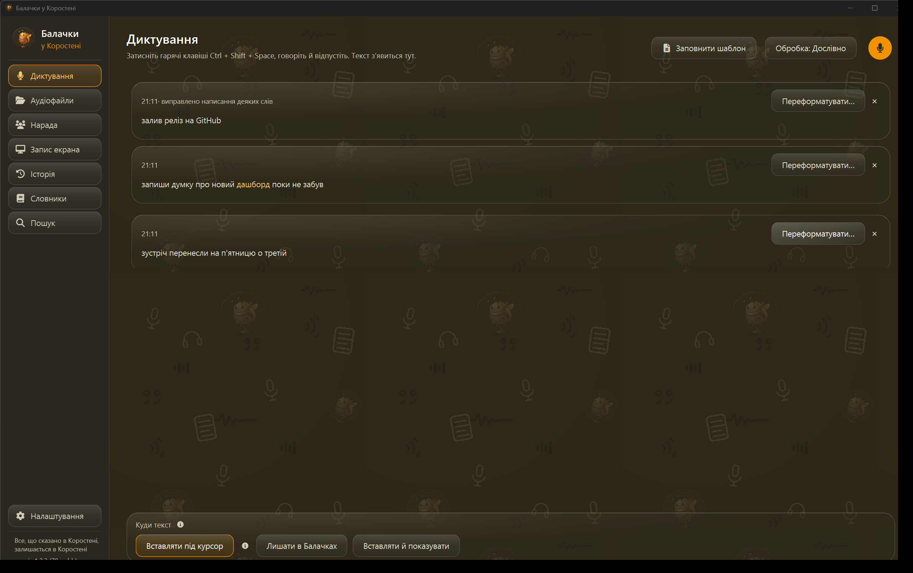
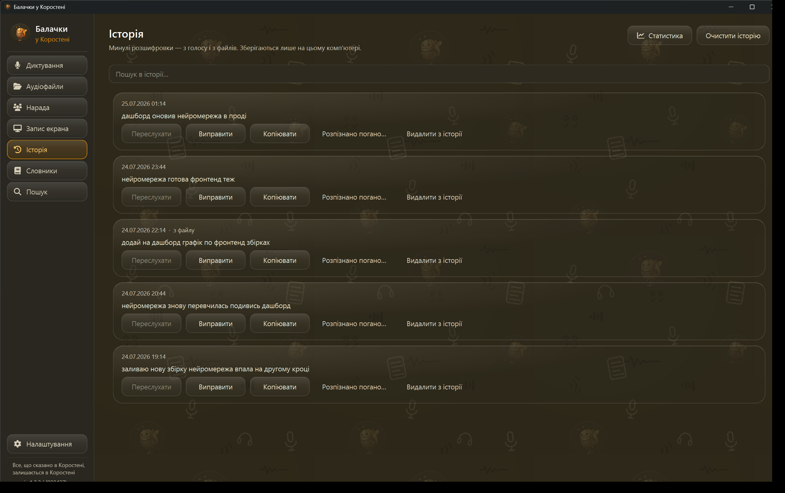
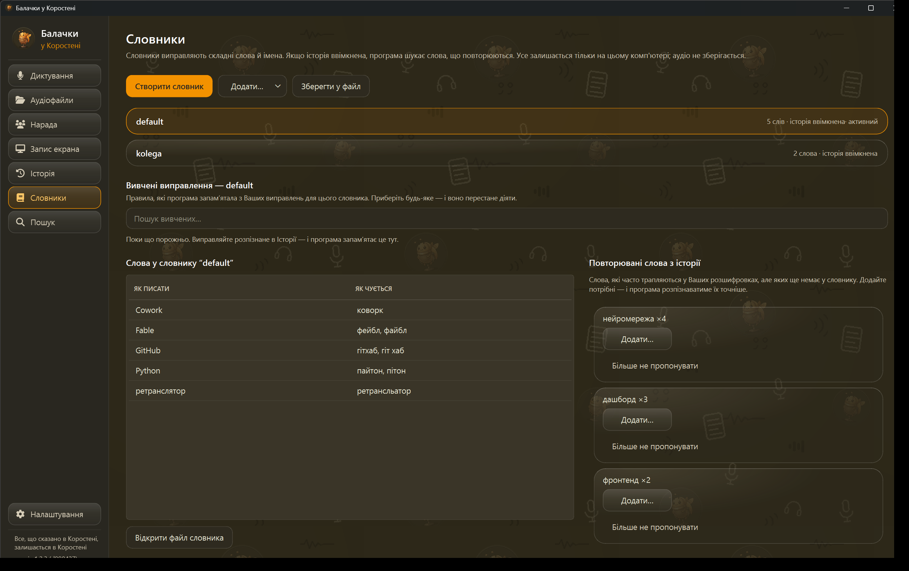
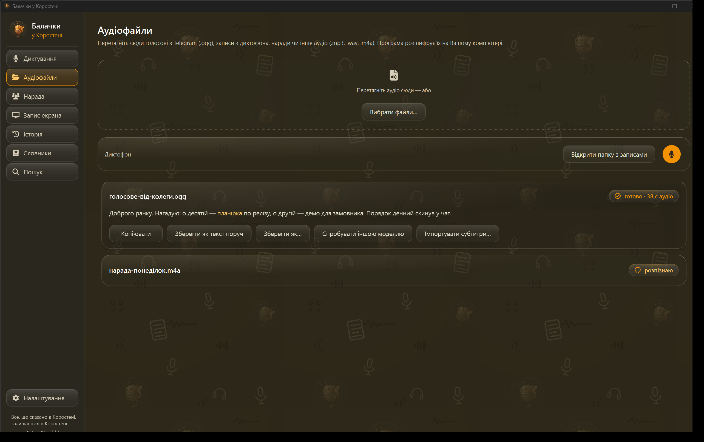
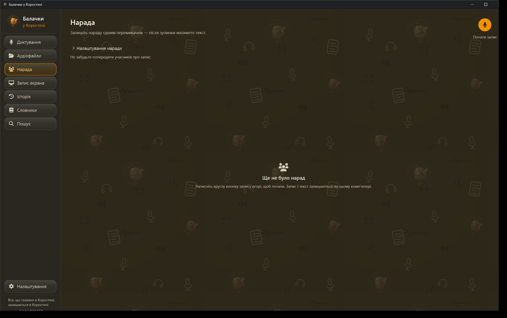
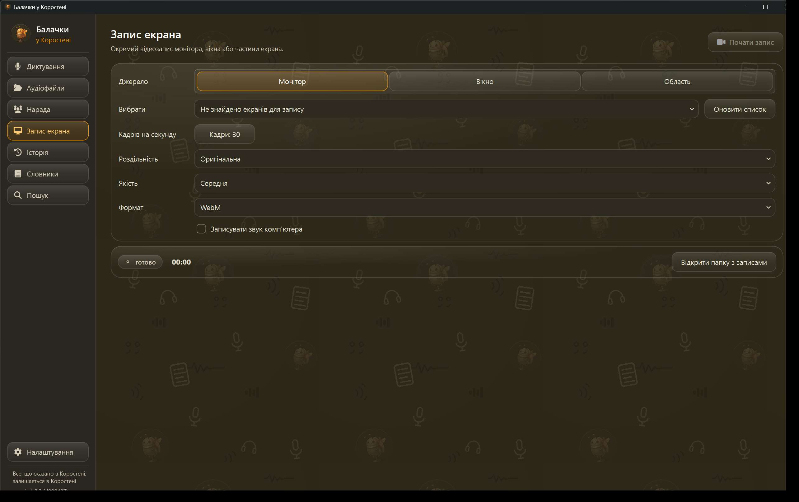
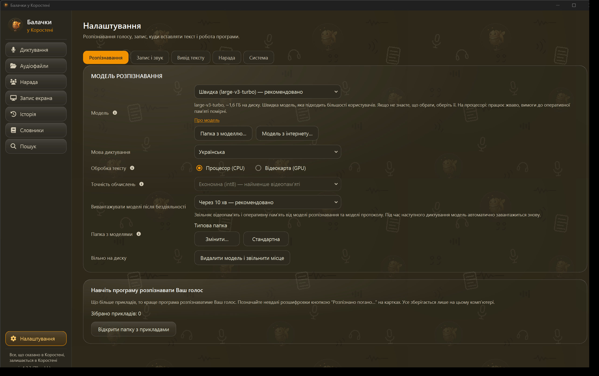

<a href="README.md">English</a> · <strong>Українська</strong>

<!-- LOGO: жук-мікрофон (маскот), ~160px, по центру. Файл: assets/mascot-512.png -->

  

<h1 align="center">Балачки у Коростені</h1>

Диктування голосом і наради українською. Повністю офлайн. Для Windows.

<em>Що сказано в Коростені — лишається в Коростені.</em>

  
  
  
  
  

  
   
  Windows 10/11 (x64) · інсталятор 158,9 МБ · безкоштовно, без реєстрації

<!-- ГОЛОВНЕ ЗОБРАЖЕННЯ: зараз живий скрін диктування (docs/screenshots/01-dictation.png); GIF-демо (~10–15 с, 15 fps). Кадр: користувач затискає комбінацію,
     говорить українською, під курсором у будь-якому полі з'являється готовий текст.
     Знімати у світлій темі за замовчуванням. Файл: assets/hero.gif -->

  

---

"Балачки у Коростені" — це програма для Windows, яка перетворює Ваше мовлення на текст у будь-якому полі будь-якої програми і збирає нараду в готовий протокол. Усе розпізнавання відбувається на Вашому комп'ютері: голос і тексти нікуди не надсилаються. Мережа використовується лише за Вашою дією для завантаження моделей, додаткових компонентів і оновлень, а також для перевірки наявності оновлення, якщо Ви її ввімкнули. Українська тут не "одна зі ста мов" у розкривному списку, а головна: інтерфейс, розпізнавання, словники й протоколи.

> Це бета-версія: нею вже можна працювати щодня, але окремі дрібниці ще змінюватимуться. Про кожну зміну чесно пишемо в журналі змін (CHANGELOG за SemVer).

## Чому Балачки?

<table>
  <tr>
    <td width="50%" valign="top">
      <h3>Українська — не другий сорт</h3>
      
Інтерфейс, розпізнавання, словники й протоколи — усе українською, з першого екрана. Це не переклад чужої програми, а інструмент, створений в Україні для українців.

    </td>
    <td width="50%" valign="top">
      <h3>Приватність — це архітектура, а не перемикач</h3>
      
Розпізнавання, протоколи й сховище працюють на Вашому комп'ютері: нуль телеметрії, нуль акаунтів. А журнал мережевої активності дозволяє не вірити нам на слово, а перевірити.

    </td>
  </tr>
  <tr>
    <td width="50%" valign="top">
      <h3>Чесність про межі ШІ</h3>
      
Якщо компонент не встановлений, програма каже "встановіть компонент", а не показує порожню заглушку. Кнопка "Прослухати" чесно чекає на свій рушій. Бета — значить бета: про все неготове ми кажемо прямо.

    </td>
    <td width="50%" valign="top">
      <h3>Безкоштовно, без підписок</h3>
      
Диктування безкоштовне назавжди — навіть для компаній. "Нарада" безкоштовна на час бети. Жодних акаунтів, карток і "пробних періодів".

    </td>
  </tr>
</table>

## Для кого

Для всіх, хто багато диктує або записує наради українською. А насамперед — для тих, чиї розмови не можна віддавати в хмару:

- **Військові.** Службові наради й рапорти лишаються на пристрої. Є захист від захоплення екрана (вмикається в Налаштуваннях) і кнопка паніки.
- **Лікарі.** Нотатки прийому й консиліуми не виходять за межі кабінету.
- **Юристи й адвокати.** Конфіденційні розмови можна тримати зашифрованими; якщо нарада лишилася відкритою, програма чесно покаже банер.
- **Журналісти.** Запис інтерв'ю не потрапляє на чужі сервери — джерело захищене технічно, а не обіцянкою.
- **Ті, хто цілий день говорить із ШІ.** Більшість із нас говорить у кілька разів швидше, ніж друкує. Диктуйте запити просто у вікно будь-якого чату — а оскільки "Балачки" працюють офлайн, Ваші чернетки не проходять через ще одну хмару дорогою до моделі.

Якщо Ви просто не хочете віддавати свій голос у хмару — програма теж для Вас.

## Можливості

Усе, описане нижче, працює без інтернету — щойно потрібні моделі завантажені.

### Диктування

- **Текст там, де курсор.** Затисніть комбінацію клавіш і говоріть — текст з'являється в будь-якому полі: пошта, месенджер, Word, чат із ШІ. Куди саме вставляти — Ваш вибір: "У вибрану програму" або "Лишати в Балачках".
- **Три рівні обробки — одним повзунком.** "Дослівно", "Без слів-паразитів" або "З пунктуацією". Дослівний текст завжди цілий в Історії — можна повернутися й звірити.
- **Переслухати й виправити себе.** Кожне диктування в Історії можна прослухати власним голосом і виправити текст. Оригінал запису лишається недоторканим. Такої функції ми в інших програмах диктування не бачили.

  
   
  Прослуховуйте, виправляйте, копіюйте й шукайте минулі розшифровки без передавання даних назовні.

- **Словник "виправив раз — назавжди".** Виправили слово один раз — помилка не повторюється. Словники ізольовані між собою: робочий і домашній не засмічують один одного, будь-яке запам'ятовування можна скасувати. А щоденник помилок покаже, які правки повторюються найчастіше, — одна кнопка, і слово в словнику.

  
   
  Тримайте робочу й особисту лексику окремо та бачте кожне вивчене виправлення.

- **Мова на Ваш вибір.** Українська — за замовчуванням. Можна обрати будь-яку з майже сотні мов, які знає модель, або довірити програмі визначити мову самостійно.
- **Голосом по документах.** Голосове редагування тексту й навігація полями Word і клітинками Excel: "наступне поле", "наступна клітинка".
- **Профіль під вікно.** Програма сама перемикає словник і режим залежно від активного вікна. А щоб текст не потрапив не туди, ціль вставки можна закріпити — і вона захищена від випадковостей.
- **Гарячі клавіші без сюрпризів.** Натискання обробляються нативно, без клавіатурних гаків. Якщо якась комбінація зайнята системою, програма чесно покаже конфлікт, а не мовчки не спрацює.
- **Готові записи теж.** Перетягніть голосове повідомлення, запис із диктофона чи інший аудіофайл. "Балачки" розшифрують його локально й дадуть скопіювати або експортувати результат.

  
   
  Розшифровуйте готові записи й експортуйте результат, не виходячи з "Балачок".

### Нарада

"Нарада" — це запис зустрічі, її розшифровка й протокол в одному місці.

  
   
  Почніть локальний запис наради однією кнопкою; запис і розшифровка лишаються на цьому комп'ютері.

- **Доріжки замість каші.** Ваш голос і голоси співрозмовників пишуться окремими доріжками. У плеєрі кожну доріжку можна вимкнути, зробити тихішою або лишити соло — і слухати все синхронно.
- **"Хто що сказав".** Жодне слово не губиться: програма сама розкладає розмову за співрозмовниками — "Спікер 1", "Спікер 2", — а Ви підписуєте імена. Кількість спікерів можна задати наперед. Якщо модель діаризації не встановлена, нарада працює у звичайному режимі.
- **ШІ-протокол — локально.** Підсумок, рішення, завдання з таймкодами й розділи генеруються на Вашому комп'ютері (модель Gemma 4, два розміри на вибір). Експорт у Word, зокрема за статутною формою рапорту.
- **Запитання до наради.** "Що ми вирішили про терміни?" — відповідь одразу з клікабельними цитатами-таймкодами: клік — і плеєр на тому місці. Якщо моделі немає, програма чесно скаже "встановіть компонент", а не покаже порожню заглушку.
- **Редагування без руйнації.** Грифові фрагменти можна заглушити — лише у вибраній доріжці; інші голоси не чіпаються. Вилучення (redaction) залишає оригінал недоторканим — змінюється лише експортована версія.
- **Двомовна пам'ять.** Нарада може пам'ятати контекст українською й англійською паралельно.
- **Відео й екран.** Запис екрана вбудований, а переглядати відео можна просто в програмі: перемотка й швидкість від 0,5× до 2× зі збереженням тону голосу.

  
   
  Записуйте монітор, окреме вікно або вибрану ділянку з потрібною якістю та форматом.

- **Дрібні турботи.** За Вашою згодою назва наради підставляється з локального календаря; нотатки експортуються в Obsidian.

### Приватність і доказовість

- **Шифрування нарад: AES-256-GCM.** Захист вмикається користувачем. Після завершення запису кожен артефакт наради шифрується окремим ключем; спосіб захисту на Ваш вибір: обліковий запис Windows, пароль, файл-ключ або пароль разом із файлом-ключем. Під час самого запису робочі файли можуть тимчасово лежати на диску відкритими — програма показує стан захисту. Разом із паролем чи файлом-ключем автоматично видається код відновлення.
  <!-- СКРІН: діалог захисту наради — чотири способи ключа -->
- **Доказовий пакет для комісії.** Одне натискання — і Ви маєте пакет із окремим скриптом перевірки (verify.py), який не потребує встановлених "Балачок" — лише Python 3 і бібліотеку cryptography. Є підтвердження перегляду другим офіцером ("чотири очі") й позначка, хто зафіксував матеріал.
- **Журнал цілісності з підписом.** Записи скріплені ланцюжком контрольних сум, а журнал підписаний ключем Ed25519. Змінений хоча б один рядок — перевірка чесно скаже BROKEN.
- **Доказова офлайновість.** Вбудований журнал мережевої активності показує завантаження моделей, додаткових компонентів, оновлень і дозволені перевірки оновлень. До нього — довідка, як перевірити трафік незалежно, сторонніми засобами.
- **Захист у полі.** Вікно програми не потрапляє на скріншоти й у програми захоплення екрана, якщо увімкнути цей захист у Налаштуваннях (за умовчанням вимкнений) — його забезпечує системний прапорець `WDA_EXCLUDEFROMCAPTURE`. Завжди, без перемикачів: програма чистить за собою буфер обміну й виключена зі стандартних звітів Windows про помилки. Кнопка паніки (комбінацію Ви призначаєте самі в Налаштуваннях) знищує розшифровані копії наради, скидає кеш паролів сховища, чистить буфер обміну й згортає вікно програми.
- **Пам'ять голосів — лише за згодою.** Програма вміє впізнавати постійних співрозмовників, але запам'ятовує голос тільки після Вашого явного дозволу.

### Озвучення ("Прослухати")

- Кнопка "Прослухати" уже є в інтерфейсі — нею текст диктування чи наради можна буде озвучити голосом.
- У білді 1.2.3 рушія озвучення ще немає: він потребує окремої збірки й надійде одним із наступних оновлень — так само офлайн. Ми радше чесно покажемо кнопку, що "ще їде", ніж вдамо, ніби все готово.

### Для тих, хто автоматизує

- **Командний рядок.** Розпізнавання, словник, історія й експорт доступні з CLI зі структурованим виводом (--json) — для скриптів і власних інтеграцій.
- **MCP-сервер.** "Балачки" вміють бути інструментом для ШІ-агентів: transcribe, search, dictionary, export, protocol. Агент працює лише в межах даних програми. Працює лише для тих, хто запускає програму з джерел, — у готовому інсталяторі ще не увімкнено. Деталі — [docs/MCP-SERVER.md](docs/MCP-SERVER.md).

### Дрібниці, до яких звикаєш

- **Центр керування моделями** у Налаштуваннях: усі моделі програми в одному місці — розпізнавання мовлення, голоси співрозмовників, ШІ-протокол, пунктуація й майбутнє озвучення. Видно розмір кожної моделі, чи вона вже завантажена і яка зараз активна, а також скільки місця вони займають разом.

  
   
  Одразу видно активні компоненти, їхні вимоги й зайняте місце на диску.

- **Тло робочої зони — на Ваш вибір:** фірмовий жук-маскот, однотонний колір або власна картинка (PNG, JPG чи WEBP до 20 МБ).
- **Модель сама звільняє пам'ять.** Якщо Ви не диктуєте певний час (наприклад, 10 хвилин), програма вивантажує модель із відеопам'яті — і відеокарта вільна для інших завдань. Наступний запис підвантажить модель назад, нічого натискати не треба.
- Скляні панелі, тло-візерунок із жуком і мікрофонами, анімований жук на заставці.
- Автооновлення з перевіркою контрольної суми: кнопка "Оновити зараз" й огляд "Що нового".
- Хаб "Про програму" відкривається кліком на шапці сайдбара: версія й номер збірки, довідка, ліцензії третіх сторін, звіт про проблему.
- Перенесення профілю на інший комп'ютер — одним файлом.

## Швидкий старт

**Системні вимоги:** Windows 10/11 (x64), 8 ГБ RAM (16 ГБ рекомендовано для нарад) і вільне місце під те, чим користуєтесь: інсталятор — 158,9 МБ, модель розпізнавання "Швидка" — близько 1,6 ГБ, модель ШІ-протоколу Gemma — близько 5 ГБ (потрібна лише для протоколів наради). Тобто для самого диктування вистачить приблизно 2 ГБ.

1. Завантажте `BalachkySetup-1.2.3-beta-F19111EF.exe` зі сторінки [v1.2.3-beta](https://github.com/mykola-zhukovets/balachky/releases/tag/v1.2.3-beta). Префікс контрольної суми — одразу в назві файла, щоб збірку було легко впізнати.
2. За бажанням звірте SHA-256 із сумою, опублікованою біля випуску:
   `F19111EFC61FBA327148E1AC29AFB339E838556663FF73300290DCC6B5D7082F`
   (у PowerShell: `Get-FileHash`).
3. Запустіть інсталятор.
4. Майстер першого запуску завантажить обрану мовну модель. **Це від 1,6 ГБ і потрібен інтернет** — саме тут, один раз. Далі програма працює офлайн. Модель ШІ-протоколу нарад (близько 5 ГБ) якщо треба, качається окремо й пізніше.
5. Затисніть **Ctrl + Shift + Пробіл** і говоріть — текст з'явиться там, де стоїть курсор. Комбінацію можна змінити в Налаштуваннях.
6. Щоб записати нараду, відкрийте вкладку "Нарада" і натисніть "Почати запис". Після зупинки отримаєте розшифровку, а далі — протокол однією кнопкою.

> **Якщо Windows покаже "Невідомий видавець".** Інсталятор бети поки без цифрового підпису — сертифікат коштує сотні доларів на рік, а програма безкоштовна. Для нової програми це нормально. Натисніть "Детальніше" → "Виконати попри це". Покрокова інструкція — [docs/INSTALL-SMARTSCREEN.md](docs/INSTALL-SMARTSCREEN.md). Підпис з'явиться пізніше.

Перевірка VirusTotal для цього точного файла: [0/65 виявлень](https://www.virustotal.com/gui/file/f19111efc61fba327148e1ac29afb339e838556663ff73300290dcc6b5d7082f/detection). Результат сканування є додатковою перевіркою, а не заміною звіряння SHA-256.

## Питання і відповіді

**Програма справді працює без інтернету?**
Так. Розпізнавання, протоколи, словники й сховище працюють локально. Мережа потрібна для завантаження вибраних Вами моделей, додаткових компонентів і оновлень, а також для дозволеної Вами перевірки оновлень. У Налаштуваннях є журнал мережевої активності й довідка, як перевірити трафік незалежно.

**Чому Windows або антивірус попереджає під час встановлення?**
Інсталятор бети поки не має цифрового підпису: сертифікат видавця коштує сотні доларів щороку, а програма безкоштовна. Тому SmartScreen показує "Невідомий видавець", а деякі антивіруси обережно реагують на нові непідписані програми. Це очікувано і не означає шкідливого коду. Щоб упевнитися, звірте SHA-256 інсталятора з сумою біля релізу, а далі — "Детальніше" → "Виконати попри це". Покроково: [docs/INSTALL-SMARTSCREEN.md](docs/INSTALL-SMARTSCREEN.md). Підпис з'явиться згодом.

**Чи потрібна відеокарта?**
Ні. Розпізнавання мови працює на звичайному процесорі. Відеокарта NVIDIA лише пришвидшить ШІ-протоколи нарад — рекомендована, але не обов'язкова.

**Скільки це коштує?**
Нічого — це безкоштовна бета. Далі так: диктування лишиться безкоштовним назавжди, навіть для комерційного використання. "Нарада" безкоштовна на час бети; про умови після бети оголосимо завчасно.

**Які мови підтримуються?**
Інтерфейс — українською та англійською. Розпізнавання — українська за замовчуванням; за бажанням — будь-яка з майже сотні мов, які знає модель, або автоматичне визначення.

**Кнопка "Прослухати" не озвучує текст. Це помилка?**
Ні. Кнопку ми вже додали в інтерфейс, а рушій озвучення ще не постачається з інсталятором — він потребує окремої збірки й надійде одним із наступних оновлень. Ми вважаємо: краще видно, що функція "ще їде", ніж приховати її.

**Що таке доказовий пакет і як його використовувати?**
Для кожної наради ведеться ланцюг цілісності: записи скріплені контрольними сумами й підписані ключем Ed25519. Одне натискання кнопки — і Ви отримуєте zip-архів із розшифровкою, метаданими й окремою програмою перевірки verify.py. Вона запускається на чистому комп'ютері, без встановлення "Балачок", — тож перевірити матеріал може й людина, яка програмою не користується. Якщо змінено хоча б один рядок, перевірка чесно скаже BROKEN.

**Як повідомити про помилку або запропонувати ідею?**
У програмі: натисніть шапку сайдбара → "Про програму" → "Повідомити про проблему". На GitHub — вкладка Issues. Номер збірки видно внизу сайдбара — додайте його до звіту, це дуже допомагає.

## Приватність

Приватність тут не перемикач у налаштуваннях, а спосіб, яким програма влаштована. Нижче — конкретно, що це означає.

**Що куди надсилається.** Голос, розшифровки, ШІ-протоколи, словники й історія нікуди не надсилаються: усе це обробляється локально. У програмі немає телеметрії, аналітики чи реклами, і для роботи не потрібен акаунт. Мережеві дії нижче можна перевірити у вбудованому журналі та сторонніми засобами.

**Єдині винятки — за Вашою командою:**

| Коли програма виходить у мережу | Навіщо |
|---|---|
| Завантаження мовної моделі | Під час першого запуску і щоразу, коли Ви оберете іншу модель |
| Завантаження додаткового компонента або голосового пакета | Лише коли Ви натиснете завантажити відповідну можливість |
| Перевірка наявності оновлення | Якщо Ви дозволили цю перевірку в налаштуваннях |
| Завантаження нової версії програми | Коли Ви вирішите оновитися; файл перевіряється за контрольною сумою |

Кожне таке з'єднання видно в журналі мережевої активності.

**Шифрування нарад.** Це додатковий захист, який вмикає користувач. Після завершення запису кожен артефакт наради шифрується окремим ключем (AES-256-GCM, ключі виводяться через HKDF; з пароля — через scrypt із великою вартістю перебору, 2^17). Де лежить головний ключ — Ваш вибір: обліковий запис Windows (системний захист DPAPI), пароль, файл-ключ або пароль разом із файлом-ключем. Під час запису робочі файли можуть тимчасово зберігатися відкритими; стан захисту видно в інтерфейсі. Разом із паролем чи файлом-ключем видається код відновлення. Як повідомити про знайдену вразливість — [SECURITY.md](SECURITY.md).

**Чесність про стан захисту.** Під час запису програма показує, коли дані ще не зашифровані, а не вдає, що все захищено. Якщо щось іде не так — відновлення чи конфігурація, — вона зупиняється, а не продовжує працювати "як-небудь". Незашифровані наради позначені помітним банером.

**Цілісність і докази.** Кожна нарада має журнал цілісності: записи скріплені ланцюжком хешів, журнал підписаний ключем Ed25519, а змінений рядок дає статус BROKEN. Для комісій є доказовий пакет із самостійною програмою перевірки (verify.py) — вона працює без встановлення "Балачок", тож перевірити матеріал може й той, хто програмою не користується. Передбачені підтвердження перегляду другим офіцером і відмітка, хто зафіксував матеріал.

**Захист у полі.** Вікно програми стає невидимим для скріншотів і захоплення екрана, якщо увімкнути цей захист у Налаштуваннях (за умовчанням вимкнений) — його забезпечує системний прапорець Windows `WDA_EXCLUDEFROMCAPTURE`, а не власні хитрощі. Завжди, без перемикачів: програма чистить за собою буфер обміну; вона виключена зі стандартних звітів Windows про помилки, щоб фрагменти Ваших даних не потрапили в чужий звіт. Кнопка паніки — комбінацію Ви призначаєте самі в Налаштуваннях, наприклад `Ctrl+Alt+Shift+X` — знищує розшифровані копії наради, скидає кеш паролів сховища, чистить буфер обміну й згортає вікно програми.

**Згода.** Пам'ять голосів співрозмовників вмикається лише за явним дозволом; назви нарад із календаря — теж за Вашою згодою. Усе, що програма запам'ятовує, лежить на Вашому диску.

**Де саме лежать Ваші дані і як їх видалити.** Окрема сторінка простою мовою: які папки створює програма, що в них, що і коли йде в мережу, як прибрати все до останнього файла — [docs/DATA-PRIVACY.md](docs/DATA-PRIVACY.md).

## Ліцензія

Вихідний код "Балачок" доступний для перегляду за [PolyForm Noncommercial](LICENSE). Це **source-available ліцензія, а не ліцензія open source за визначенням OSI**: некомерційне використання безкоштовне для всіх — окремих людей, шкіл, лікарень, держустанов і Збройних Сил; платні клони й перепродаж коду заборонені.

Для комерційного використання діють окремі дозволи (деталі — у файлі [COMMERCIAL-LICENSE.md](COMMERCIAL-LICENSE.md)):

- **Диктування — безкоштовне назавжди**, включно з компаніями.
- **"Нарада" — безкоштовна на час бети** (і ще 30 днів після виходу стабільної версії). Про умови після бети оголосимо завчасно; диктування це не стосується ніколи. Усі протоколи, розшифровки й записи, створені під час бети, залишаться Вашими — доступними для читання й експорту безкоштовно назавжди, які б умови не діяли потім.
- **Озвучення голосом — тільки для некомерційних потреб.** Комерційний дозвіл покриває програму й розпізнавання мовлення; майбутній рушій озвучення до нього не входить, бо одна з його складових поширюється за некомерційною ліцензією CC BY-NC 4.0.

Звукова частина побудована на FFmpeg за LGPL, без GPL-кодеків (x264/x265), — юридично чисто для розповсюдження. Ліцензії третіх сторін — у програмі ("Про програму") та у файлі [THIRD-PARTY-NOTICES.txt](THIRD-PARTY-NOTICES.txt).

## Підтримати проєкт

Найкраща допомога зараз — спробувати програму й розповісти, що не так: "Про програму" → "Повідомити про проблему" або [Issues](https://github.com/mykola-zhukovets/balachky/issues). А якщо все так — розкажіть про "Балачки" тим, кому вони потрібні. У розділі "Про автора" є кнопка "Підтримати".

Зроблено в Коростені, Україна.

